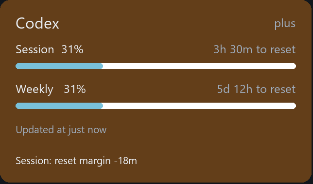
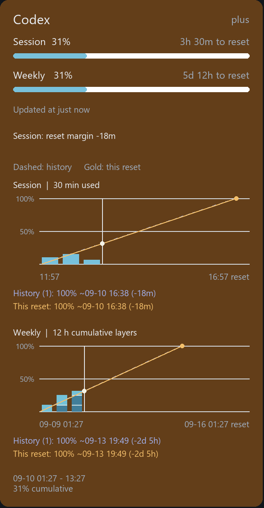

# CodexGauge

Windows Rainmeter skin for monitoring OpenAI Codex usage limits.

CodexGauge shows the current five-hour session and seven-day weekly windows,
reset countdowns, usage trends, forecasted limit times, and fetch health in a
compact Rainmeter panel. It is an unofficial community project.





## Features

- Session usage across ten 30-minute buckets.
- Weekly usage across fourteen 12-hour cumulative layers.
- Fixed 0–100% graph scale with 50% and 100% guides.
- Historical and current-reset trend lines.
- Forecasted time when usage reaches the limit.
- Relative update age with the exact fetch time on hover.
- Orange usage warnings and red fetch-error state.
- Up to three recent safe error messages.
- Local runtime history with no credentials written to the repository.

## Requirements

- Windows
- Rainmeter 4.x
- PowerShell 5.1 or newer
- Codex CLI signed in locally

The collector reads the local Codex authentication state at runtime. It does
not store or display access tokens.

## Install

1. Install Rainmeter and sign in to Codex locally.
2. Copy this repository to a working directory.
3. Run the deployment script:

```powershell
powershell -NoProfile -ExecutionPolicy Bypass -File .\tools\Deploy-Skin.ps1 -Refresh
```

The script discovers the usual Rainmeter skin locations. To specify an exact
skin directory:

```powershell
powershell -NoProfile -ExecutionPolicy Bypass -File .\tools\Deploy-Skin.ps1 `
  -Target "$env:USERPROFILE\Documents\Rainmeter\Skins\CodexGauge" -Refresh
```

The deployment preserves the live `Usage.inc` and usage history. Runtime
state remains local and is excluded from Git.

## Repository layout

| Path | Purpose |
| --- | --- |
| `artifacts/rainmeter-skin/` | Deployable Rainmeter skin |
| `artifacts/rainmeter-skin/@Resources/Scripts/FetchUsage.ps1` | Usage collector and local history |
| `artifacts/rainmeter-skin/@Resources/Scripts/GraphModel.lua` | Graph calculations |
| `artifacts/rainmeter-skin/@Resources/Scripts/GraphView.lua` | Rainmeter graph geometry |
| `tests/` | Collector and graph tests |
| `tools/Deploy-Skin.ps1` | Backup, deploy, and optional refresh |
| `docs/` | Public requirements and design notes |

## Test

Run the tests from the repository root:

```powershell
python -m unittest discover -s tests -p 'test_*.py'
powershell -NoProfile -ExecutionPolicy Bypass -File .\tests\test_collector.ps1
```

The Python tests exercise the Lua graph/controller modules. The PowerShell
tests use temporary fixtures and do not make network or authentication calls.

## Privacy and security

The repository intentionally excludes authentication files, tokens, cookies,
passwords, usage history, raw conversations, private recovery backups, and
internal engineering records. Review `.gitignore` before publishing changes.

Never commit a real `auth.json` or any credential material. Public screenshots
must be redacted and stored under `docs/images/`.

## Documentation

- [Project overview](docs/00-project-overview-ko.md)
- [Requirements](docs/01-requirements-ko.md)
- [Architecture and data flow](docs/02-architecture-data-flow-ko.md)
- [Graph specification](docs/03-graph-spec-ko.md)
- [Error and hover behavior](docs/04-error-hover-behavior-ko.md)
- [Change history](docs/05-change-history-ko.md)
- [Known UI solution](docs/solutions/ui-bugs/rainmeter-hidden-bounds-and-forecast-normalization-2026-09-10.md)
